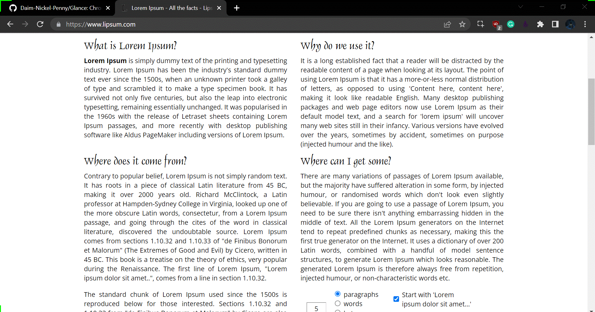

# Glance

##    

## Download Link : Version 1.0.0

Link to download the extension: <a href="https://github.com/Daim-Nickel-Penny/Glance/Glance-main.zip" target="_blank">here</a>

# Project Title

**Description**: This is a browser extension designed primarily for the Chrome browser that converts the text into bionic reading format.

## What is Bionic Reading?

**Bionic Reading** is a new method facilitating the reading process by guiding the eyes through text with artificial fixation points. As a result, the reader is only focusing on the highlighted initial letters and lets the brain center complete the word.  
In a digital world dominated by shallow forms of reading, Bionic Reading aims to encourage a more in-depth reading and understanding of written content.

Other things to include:

- **Technology stack**: JavaScript, HTML, CSS
- **Status**: 
- **Links to production or demo instances**

## Demo

## Dependencies

    "NodeJs":  "^11.0.0"

## How to test the extension?

1. Vist [chrome://extensions](chrome://extensions) in your browser
2. Toggle **Developer Mode On** from the top-right of the window.
3. Select the **Load Unpacked** button.
4. Browse to the **Glance root folder** and select it.
5. **Pin** the extension in the window.
6. Set the **anchor position** from the extension pop-up.
7. Now, select the word for finding its meaning.

## Known issues

There are issues in letter and line spacing which will be fixed in the future updates.

---

## Open source licensing info

1. [LICENSE](LICENSE)

---

## Credits and references

Make sure to star if you feel like!
